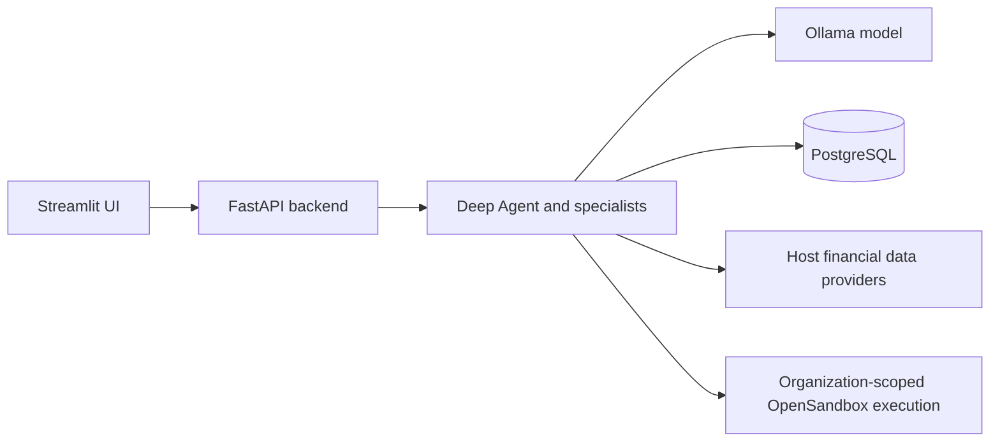

# Financial Research Deep Agent

A financial research assistant with a Streamlit chat interface, a FastAPI backend,
PostgreSQL conversation persistence, and organization-scoped Python execution through
OpenSandbox. Built with Deep Agents, LangGraph, and LangChain.

[Quick start](#quick-start) · [Configuration](#configuration) · [Usage](#usage) ·
[Architecture](#architecture) · [Tests](#tests) · [Troubleshooting](#troubleshooting)

## Features

- Market quotes, company fundamentals, historical prices, financial news, and treasury data.
- Specialist agents for financial research and analysis, with inherited financial tools.
- CSV and Excel analysis: small inputs are included in agent context; larger inputs use
  the organization's sandbox when execution is available.
- Saved conversation history and persistent agent memory through PostgreSQL.
- Per-organization sandbox provisioning and idle cleanup, with file-ownership checks.
- Sanitized execution diagnostics and explicit provider failures, including partial
  treasury results that preserve valid data.

> [!NOTE]
> Research depends on retrieved evidence and provider availability. Prompt rules reduce
> unsupported claims but do not guarantee factual accuracy. Review source data and
> calculations before using a generated report.

## Quick start

### Prerequisites

- Python **3.12 or newer** and **uv**.
- A running PostgreSQL database with credentials authorized to create the persistence tables.
- Access to the configured Ollama model: `ollama:gpt-oss:120b-cloud`.
- Docker and an authenticated OpenSandbox management server for Python script execution.
  The application can run with reduced capabilities when the sandbox is unavailable.

Run commands from the repository root. Setup and startup commands below work in
PowerShell, Bash, and similar shells, except where a platform is explicitly named.

### 1. Install dependencies

```sh
uv sync --frozen
```

Copy the environment template using the command for your shell:

```powershell
# PowerShell
Copy-Item .env.example .env
```

```sh
# Bash
cp .env.example .env
```

Edit `.env` and replace placeholders with your existing database, model-provider,
and sandbox settings. PostgreSQL is not included in the Compose recipe. Backend
startup initializes the PostgreSQL store and checkpoint tables.

### 2. Connect the sandbox management server

If you already have a management server, set `OPEN_SANDBOX_DOMAIN` and use its existing
API key. To start the included local Docker recipe instead:

```sh
docker compose --env-file .env config --quiet
docker compose --env-file .env up -d opensandbox
```

> [!IMPORTANT]
> Do not start another management server on an occupied port 8080. This Compose recipe
> mounts the Docker socket and is intended for a trusted local environment. Preserve
> another deployment's existing configuration and network policies.

### 3. Start the backend

In terminal 1:

```sh
uv run --frozen python -m uvicorn app:app --host 127.0.0.1 --port 8000
```

### 4. Start the UI

In terminal 2:

```sh
uv run --frozen python -m streamlit run static/app.py
```

Open **http://localhost:8501**. If the backend is already running, start only the UI.
The UI and backend are separate processes; no root `app.py` launcher or `langgraph dev`
command is required. Stop each process with Ctrl+C.

## Configuration

Use [.env.example](.env.example) as the starting point. Keep actual credentials in
ignored local files or your process environment.

| Setting | Purpose |
| --- | --- |
| `DB_URL` | PostgreSQL connection URL for conversation checkpoints and persistent memory. |
| `OLLAMA_URL` | Model-provider endpoint; use this spelling, not `OLALAMA_URL`. |
| `OLLAMA_API_KEY` | Model-provider credential when required by the configured service. |
| `OPEN_SANDBOX_DOMAIN` | Management API host and port, typically `localhost:8080`. |
| `OPEN_SANDBOX_API_KEY` | Existing management-server API key; authentication stays enabled. |
| `OPEN_SANDBOX_USE_SERVER_PROXY` | Use the management server's proxy when direct container endpoints are inaccessible. |
| `OPEN_SANDBOX_CONFIG_FILE` | Optional readable server TOML; its `server.api_key` overrides the environment key. |
| `SANDBOX_IMAGE` | Code-interpreter image used for execution containers. |
| `FMP_API_KEY` | Optional Financial Modeling Prep credential. |
| `ALPHA_VANTAGE_API_KEY` | Optional Alpha Vantage credential for scripts that use it. |
| `BACKEND_URL` | UI's backend address; defaults to `http://localhost:8000`. Set in the UI process environment. |

The backend loads root `.env` without replacing existing process variables. Explicit
server TOML takes precedence for sandbox authentication. The shared server launcher
preserves a selected TOML's full configuration; mount that file and use its
container-readable path if configuring the server container this way. The SDK sends
credentials using the management API's `OPEN-SANDBOX-API-KEY` header.

Restart the backend after editing its environment. Restart the UI after changing
`BACKEND_URL`; the UI does not independently load root `.env`. Compose also gives shell
variables precedence over `.env`. Changed container environment requires recreation:

```sh
docker compose --env-file .env up -d --force-recreate opensandbox
```

## Usage

Ask a question in the UI, choose a conversation, or upload a CSV or `.xlsx` workbook
for analysis. File parsing depends on the installed pandas reader and Excel engine;
legacy workbook formats may require additional support.

Example research prompt:

> Research Focus Point Holdings Berhad (Bursa Malaysia 0157 / 0157.KL). Retrieve
> financial statements and valuation data, cite the evidence used, and identify
> unavailable data without inventing peers, catalysts, or news.

The API documentation is available at **http://127.0.0.1:8000/docs**. Common routes:

| Route | Purpose |
| --- | --- |
| `POST /api/chat` | Send a message with thread, user, and organization identifiers. |
| `POST /api/chat/stream` | Stream an agent response. |
| `POST /api/files/upload` | Upload a file with an organization identifier. |
| `POST /api/chat-with-file` | Analyze an uploaded file; a streaming variant is also available. |
| `GET /api/threads` | List conversations. |
| `GET /api/history/{thread_id}` | Retrieve conversation history. |
| `GET /api/sandbox/status` | Inspect `available`, `active_count`, and sanitized `error`. |

Sandbox availability is checked through container creation and execution, not only a
health response. Host-side market tools remain independent of sandbox availability.
Treasury results report `success`, `partial_success`, or `error`, preserve valid quotes,
and separate direct yields from Yahoo yield-index proxies.

## Structured financial research output

The main DeepAgent returns a validated Pydantic `AnalysisReport` using LangChain
ToolStrategy. Reports contain Executive Summary, Key Findings, Risks, Recommendations,
Confidence, typed metrics, evidence sources, missing-data notices and sanitized tool errors.
Readable text derives from that report. JSON-looking model text is never accepted as a
replacement for the final graph structured_response.

Chat requests default to `"response_schema": "analysis_report"`. Set it to null for ordinary
chat, or use the Streamlit checkbox. Unsupported schema names fail explicitly. Invalid
completion gets at most two correction retries before an exposed error.

JSON endpoints return readable `reply` and typed `structured_response`. SSE emits progress,
then one validated `report` event, then `done`. The structured_response field now lives in
`report`, while done retains readable reply. Interrupted, failed and incomplete runs are
not saved as completed reports. Restart both application processes after updating.

See [the complete contract, examples, reference findings and migration notes](docs/structured-output.md).

## Architecture



| Directory | Contents |
| --- | --- |
| `app/` | API routes, agent configuration, persistence lifecycle, financial tools, and sandbox management. |
| `static/` | Streamlit UI entrypoint. |
| `_tools/` | Uploaded-file parsing helpers. |
| `scripts/` | Provider clients and analytics/reporting scripts. |
| `skills/` | Runtime agent skill packages. |
| `deployment/` | Shared sandbox credential resolver and server launcher. |
| `tests/` | Fake-client regression tests. |
| `.github/workflows/` | GitHub Actions checks. |

> [!NOTE]
> This checkout currently contains only a placeholder in `skills/`. Restore the intended
> `SKILL.md` packages there before expecting skill-based workflows. The local coding-agent
> `.agents/` directory is separate and excluded from publication.

## Tests

```sh
uv run --frozen python -B -m unittest discover -s tests -v
```

Additional checks:

```powershell
# Windows
uv pip check --python .venv/Scripts/python.exe
```

```sh
# Linux/macOS
uv pip check --python .venv/bin/python
```

```sh
docker compose --env-file .env config --quiet
```

The 64 regression tests cover sandbox failures and retries, concurrent provisioning,
cleanup races, provider outcomes, organization file ownership, specialist tools, backend
initialization, persistence cleanup, and UI backend configuration. GitHub Actions installs
frozen dependencies and runs fake-client tests plus Compose validation without live
credentials. These checks do not prove live provider or infrastructure availability.

## Troubleshooting

| Symptom | What to check |
| --- | --- |
| Windows error 10048 or address already in use | A backend is already listening. Reuse it or select another port; do not start two backends on port 8000. |
| UI opens but requests fail | Confirm the backend is running and the UI process has the correct `BACKEND_URL`. |
| PostgreSQL startup failure | Confirm `DB_URL`, database reachability, credentials, and table-creation permissions. |
| `INVALID_API_KEY` | Match the effective application and management-server keys; inspect environment/TOML precedence, then restart the backend. |
| Sandbox creation works but readiness fails | If direct endpoints are unreachable, enable `OPEN_SANDBOX_USE_SERVER_PROXY=true`. |
| Empty news or unavailable quotes | Inspect actual provider results; an empty result is distinct from a failed request. |
| Agent cannot use expected skills | Restore the missing runtime packages under `skills/`. |

For alternate ports, start the backend with `--port 18001`. Then set the UI address
in terminal 2 before launching Streamlit:

```powershell
# PowerShell
$env:BACKEND_URL = 'http://127.0.0.1:18001'
uv run --frozen python -m streamlit run static/app.py --server.port 18501
```

```sh
# Bash
BACKEND_URL=http://127.0.0.1:18001 uv run --frozen python -m streamlit run static/app.py --server.port 18501
```

## Publishing to GitHub

Review the proposed file set before committing. `.env`, `sandbox.toml`, local agent state,
and generated files are ignored. Rotate any active credential previously exposed in
source or terminal output. Create an empty GitHub repository, replace the placeholder
URL below, and run:

```sh
git add .
git diff --cached --stat
git commit -m "Prepare financial research application"
git branch -M main
git remote add origin <YOUR_GITHUB_REPOSITORY_URL>
git push -u origin main
```
